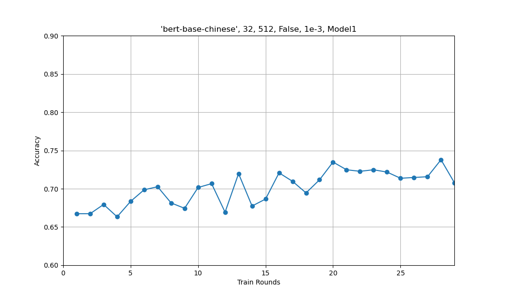
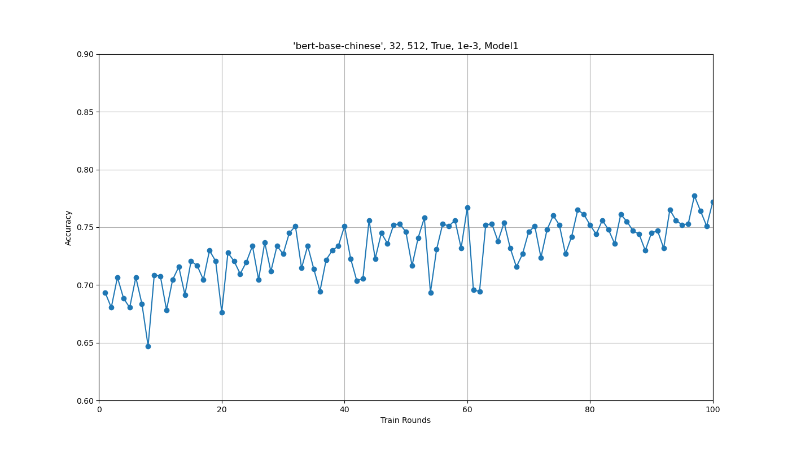
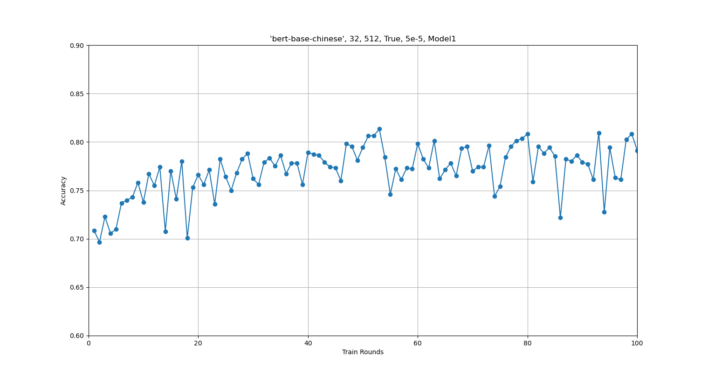
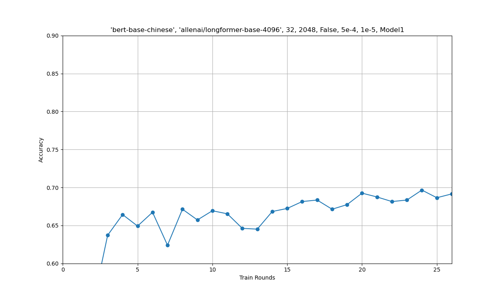
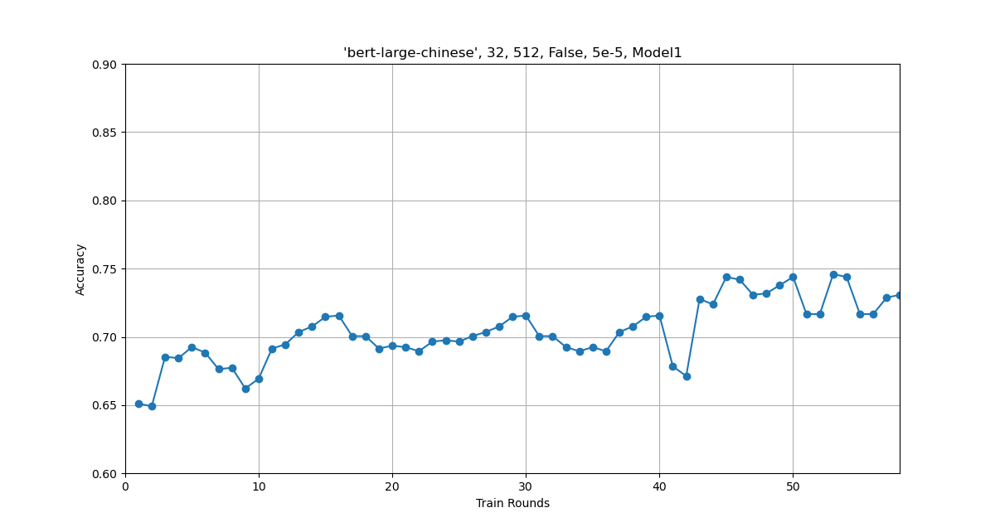

#CodeMate

本项目分为两部分：爬虫部分实现了对一些网站数据的爬取；分类器部分实现了对爬取数据质量筛选的分类器的训练。

## 爬虫

爬取的内容为 `程序设计` 相关，搜索的关键词列表为：

```
content=[
"计算机硬件",
"计算机软件",
"算法与程序设计",
"程序的编译和调试",
"注释",
" 编译预处理",
"主程序",
"名字空间",
"变量定义",
"数据类型",
"整型",
"实型",
"字符型",
"布尔型",
"枚举类型",
"⽤typedef重新命名类型名",
"定义新的类型",
"变量赋初值",
"⽤sizeof了解占⽤的内存量",
"符号常量",
"算术运算",
"主要的算术运算符",
"各种类型的数值间的混合运算",
"整数除法和取模运算符",
"优先级",
"数学函数库",
"赋值运算",
"赋值运算符",
"赋值时的⾃动类型转换",
"赋值的嵌套",
"多重赋值",
"复合赋值运算",
"⾃增和⾃减运算符",
"强制类型转换",
"数据的输⼊",
"数据的输出",
"构思⼀个程序",
"程序设计⻛格",
"关系运算",
"关系运算符",
"关系表达式",
"逻辑运算",
"if语句",
"if语句的形式",
"if语句的嵌套",
"if语句的应⽤",
"条件表达式",
"switch语句及其应⽤",
"for循环",
"重复n次操作",
"for语句的进⼀步讨论",
"for循环的嵌套",
"数组",
"函数",
"指针",
"结构体",
"模块化开发",
"类的定义与使⽤",
"运算符重载",
"组合与继承",
"模板",
"输⼊输出与⽂件",
"异常处理",
"容器和迭代器",
]
```


### **爬虫基础学习**：

#### 网络请求

当我们访问一个网页的时候，实际上是浏览器向对应网址解析后的 ip 的服务器发送了一些请求，然后通过获取的回复来构建出的页面。


#### 实战

##### CSDN

由于我们要爬取的是 QA 问答对的形式，所以我们进入 CSDN 搜索关键字后，点击下方的问答并选中已采纳。接下来我们可以看到下面列出了若干个问题和最佳答案。
我们点开控制台，进入 Network 项会看到一个 search? q开头的包。进入 response 项，我们便能看到服务器给我们的响应了。
这是一个 json 文件，也是一个字典。再在里面翻找，我们会发现在result_vos 中有我们需要的更多的信息，比如单个问答的 url。复制打开后，我们会发现我们进入了单个问答的网页。
```
response= requests. get(url)
dic= response.json()
qa_list=dic['result_vos']
```

因此，首先进入搜索后的页面得到刚刚这个包，再在响应中找到每个问答的网页，再进去继续获取具体的信息。

```
detail_url=qa['url']
detail_response= await get(url=detail_url)
ans=qa['answer']
tree= etree.HTML(await detail_response.text())
```

接下来，我们再在单个问答的具体网页中获取问题和答案。再次进入控制台，在 Elements 项中找到点击标题，问题，答案等，可以发现它们在 html 中的位置。此时就要用到 xpath 相关的知识了。比如

```
title = tree.xpath("//section[@class='title-box']/h1/text()")[0]
question = tree.xpath('//section[@class="question_show_box"]//div[@class="md_content_show"]//text()')
answer = tree.xpath('//section[@div="@class=answer_box"]//div[@class="md_content_show"]//text()')
```
于是，对于这一个问答网页，我们应该就能通过程序获取对应的问题和答案了。

当我们启动程序后，我们大概会发现，title 和 question 确实都被爬下来了，但是 answer 却啥都没有。

而当我们尝试 Ctrl+F搜索答案中的某些字时，会发现它们是被套在一个 script 块内的函数中的，这意味着它是被动态渲染出来的。这样一来，我们便不能直接在收到的包中找到它。

在 result_vos对应的字典内，有关键字 answer 已经对应了最佳回答的全部文本。也就是说，我们可以在这个页面就获得答案。。


##### wikipedia

在进入wiki网站并对相关条目进行搜索后，进入控制台可以发现，并没有像csdn那样的字典结构可以方便的让我们爬取问答，而且wiki中的内容还分为多级标题，这无疑也让爬取难度加大了。
但是对其网页结构进一步观察后我们可以发现，每一个标题后都跟有“编辑”二字，那我们就有了一个办法可以对相关内容进行爬取，也就是对文本进行遍历，当遍历到“编辑“二字时就把对应标题和内容组成一个问答对
以下是代码：

```
import requests
import json
import jsonlines
from lxml import etree
main_url='https://zh.wikipedia.org/wiki/{}'
for l in range(0,len(content)):
    url=main_url.format(content[l])
    response=requests.get(url)
    if response.status_code==404:
        continue
    tree=etree.HTML(response.text)
    first=tree.xpath('//div[@class="mw-parser-output"]//div[@id="toc"]/preceding-sibling::p//text()')
    if not first:
        first=tree.xpath('//div[@class="mw-parser-output"]/p//text()')
    # first[0]=''
    ans=""
    for ele in first:
        ans+=ele
    print(ans)
    name="p{}.jsonl"
    qas={
    "Answer": ans,
    "Knowledge_Point": content[l],
    "Question": "什么是："+content[l],
    "Tag": "程序设计"
    }
    with jsonlines.open(name.format(content[l]), 'a') as fp:
        fp.write( qas)
    main_part=tree.xpath('//div[@class="mw-parser-output"]//text()')
    last=''
    flag=0
    titles =[]
    i=0
    for ele in main_part:
        i+=1
        if (flag==1):
            if(ele=='\n\n'):
                continue
            if(ele=='\n'):
                continue
            if(ele==' '):
                continue  
            if(ele=='['):
                break
            titles.append(ele)
        if(ele=="目录"):
            flag=1
    print(titles)
    last=""
    cout=''
    body=[]
    ii=0
    flag=0
    i=len(main_part)
    while (ii<i):
        if (flag==1):
            if(main_part[ii]=='['):
                if(main_part[ii+1]=="编辑"):
                    ii+=3
                    print(content[l]+':'+last)
                    last=''
                    while(ii!=i-1 and not(main_part[ii]=='['and main_part[ii+1]=="编辑")):
                        cout+=last
                        last=main_part[ii]
                        ii+=1
                    if(ii==i-1):
                        cout+=last
                    body.append(cout)
                    cout=''
                    if(ii==i-1):
                        break
                    ii-=1
            last=main_part[ii]
        if(main_part[ii]=="目录"):
            flag=1
        ii+=1
    dic={}
    j=0
    jj=len(titles)
    print (titles)
    print (jj)
    jb=''
    i=0
    while(j<jj-1):
        tmp=int(len(titles[j])/2)
        print(titles[j])
        print(tmp)
        j+=1
        dic[tmp]=titles[j]
        tmppp=1
        jb=content[l]+":"+dic[0]
        while(tmppp<=tmp):
            jb+=':'
            jb+=dic[tmppp]
            tmppp+=1
        print(jb)
        name="pp{}.jsonl"
        qas={
            "Answer": body[i],
    "Knowledge_Point": content[l],
    "Question": "什么是："+jb,
    "Tag": "程序设计"
        }
        with jsonlines.open(name.format(content[l]), 'a') as fp:
            fp.write( qas)
        i+=1
        j+=1
```


### 爬虫进阶学习：

本项目实现了对 CSDN 问答，Wikipedia，stackoverflow 三个网站的数据爬取。

以下是各网站的爬虫介绍。

### CSDN

CSDN 网站分为两部分：
- 搜索关键字后爬取对应的数据
- 在[CSDN问答的精华版块](https://ask.csdn.net/channel/1005?rewardType&stateType=0&sortBy=1&quick=6&essenceType=1&tagName=essence)爬取所有数据。

#### 第一部分

思路是类似的

但是通过 `asyncio` 库，利用协程实现了并行爬虫。

代码如下：
```
import json    
import requests
import asyncio
import aiohttp
from lxml import etree

async def get(url):
session = aiohttp.ClientSession()
respons = await session.get(url)
await respons.text()
await session.close()
return respons

async def request(url,l,i):

response= await get(url)
print(l,i)
dic=await response.json()
if 'result_vos' in dic:
qa_list=dic['result_vos']
else:
return None

    if not qa_list:
        return None
        # if(len(qa_list)==0):
        #     continue
    QAS={}
    cnt=0
        
    for qa in qa_list :
        detail_url=qa['url']
        ans=qa['answer']
        detail_response= await get(url=detail_url)
        print(cnt)
        tree= etree.HTML(await detail_response.text())
        title=tree.xpath('//section[@class="title-box"]/h1/text()')
        question=tree.xpath('//section[@class="question_show_box"]//div[@class="md_content_show"]//text()')
            
        if(len(question)>0 and len(title)>0):
            que=""
            tit=title[0]
            
            for k in range(0,len(question)):
                que=que+question[k]
                    
            QAS[cnt]={"Answer":ans,"Knowledge_Point":"程序设计","Question":tit+que,"Tag":"程序设计"}
            cnt+=1
            
    with open('./p{}{}.json'.format(content[l],i),"w",encoding="utf-8") as fp:
        json.dump(QAS,fp=fp,indent=2,sort_keys=True,ensure_ascii=False)


main_url="https://so.csdn.net/api/v3/search?q={}&t=ask&p={}&s=0&tm=0&lv=-1&ft=0&l=&u=&ct=-1&pnt=-1&ry=-1&ss=-1&dct=-1&vco=-1&cc=-1&sc=-1&akt=-1&art=-1&ca=1&prs=&pre=&ecc=-1&ebc=-1&ia=1&dId=&cl=-1&scl=-1&tcl=-1&platform=pc&ab_test_code_overlap=&ab_test_random_code="
max=10000
for l in range(0,len(content)):

    if max==1:
        max=10000
        continue    
    tasks=[]
    for i in range(1,21):
        url=main_url.format(content[l],i)
        tasks .append(asyncio.ensure_future(request(url,l,i)))
    loop = asyncio.get_event_loop()
    loop.run_until_complete(asyncio.wait(tasks))
    max=10000
            # pass
```


#### 第二部分

首先，需要进入 [https://ask.csdn.net/channel/1005?rewardType&stateType=0&sortBy=1&quick=6&essenceType=1&tagName=essence](https://ask.csdn.net/channel/1005?rewardType&stateType=0&sortBy=1&quick=6&essenceType=1&tagName=essence) 页面获得所有具体问答的链接。这一步骤在 [`CSDN.py`](https://github.com/zsq259/PPCA_codemate/blob/main/crawler/CSDN/CSDN.py) 中解决。代码主要利用 `playwright` ，模拟了鼠标滚轮下滑来获取所有链接。
利用selenium库进行模拟页面滑动进行爬虫，
代码如下：
```
from selenium import webdriver
from selenium.webdriver.common.keys import Keys
from bs4 import BeautifulSoup
import time
import requests
import json
import jsonlines
from lxml import etree
from opencc import OpenCC
# import threading
# cnt=0
# 启动浏览器
options = webdriver.ChromeOptions()
options.set_capability("unhandledPromptBehavior", "ignore")
driver = webdriver.Chrome(executable_path="C:\Program Files\Google\Chrome\Application\chromedriver", options=options)

# 导航到CSDN精华区数据结构与算法模块链接
url = "https://ask.csdn.net/channel/1005?rewardType&stateType=0&sortBy=1&quick=6&essenceType=1&tagName=essence"
driver.get(url)

# 自动向下滑动页面
def scroll_down():
    for i in range (1,135):
        print(i)
    # 模拟按键向下滑动页面
        driver.execute_script("window.scrollTo(0, document.body.scrollHeight);")
        time.sleep(3)  # 等待页面加载新内容
   

# 爬取问答内容的链接
def get_question_links():
    soup = BeautifulSoup(driver.page_source, 'html.parser')
    question_links = []

    # 使用BeautifulSoup或其他HTML解析库提取问答链接
    # 将问答链接添加到question_links列表中

    return question_links

# 进入链接并爬取问答内容
def crawl_question_content(question_link):
    # 使用Selenium导航到链接//*[@id="answer_54269834"]/div[1]
    qas={}
    # cnt=0
    driver.get(question_link)
    # if response.status_code==404:
    #     continue
    # tree=etree.HTML(response.text)
    html = driver.page_source
    tree=etree.HTML(html)
    title=tree.xpath('//section[@class="title-box"]//h1/text()')
    question=tree.xpath('//section[@class="question_show_box"]//div[@class="md_content_show"]//p/text()')
    # print(title)
    # print(question)
    ans=tree.xpath('//div[@class="ask-issue-content-expand normal-style ask-issue-content"]//div[@class="md_content_show"]//text()')
    # print(ans)
    if len(title)==0 or len(question)==0 or len(ans)==0:
        return
    
    que=title[0]
    an=""
    # cnt+=1
    # print(cnt)
    for ele in ans:
        an+=ele
    for ele in question:
        que+=ele
    qas={"Answer":an,"Knowledge_Point":'数据结构与算法',"Questions":que,"tag":'数据结构'}
    with jsonlines.open("数据结构与算法.jsonl", 'a') as fp:
            fp.write( qas)
    # 使用相应的爬虫技术提取问答内容，并进行后续处理

# 主程序流程
scroll_down()  # 模拟向下滑动页面加载内容

html = driver.page_source
tree=etree.HTML(html)
#  title=tree.xpath('//section[@class="title-box"]/h1/text()')[0]/html/body/div[3]/div/main/div/div[1]/div[2]/div/div/div[1]/ul[1]/li/div[1]
#  question=tree.xpath('//section[@class="question_show_box"]//div[@class="md_content_show"]//text()')
title=tree.xpath('//div[@class="title-box"]//a/@href')

print (title)
print(len(title))

links=[]
for i in range(0,4000):
    links.append(title[i])
  # 获取前3000条问答链接
print(len(links))
# cnt=0
cnt=0
for link in links:
    cnt+=1
    print(cnt)
    crawl_question_content(link)  # 爬取问答内容
    

# 关闭浏览器
driver.quit()
```

### Wikipedia

在scrapy框架下进行爬虫：
```
import scrapy
import jsonlines
from lxml import etree
import requests
from mySpider.items import ItcastItem
main_url='https://zh.wikipedia.org/wiki/{}'
class ItcastSpider(scrapy.Spider):

    name = "itcast"
    start_urls=[]
    # allowed_domains = ["itcast.cn"]
    def start_requests(self):
        
        for l in range(0,len(content)):
            self.start_urls.append(main_url.format(content[l]))
        for l, url in enumerate(self.start_urls):
            yield scrapy.Request(url, callback=self.parse, cb_kwargs={'l': l})
        # for url in urls:
        #     yield scrapy.Request(url, callback=self.parse)
    # start_urls = ("http://www.itcast.cn/channel/teacher.shtml",)

    def parse(self, response,l):
        if response.status!=200:
            return
        tree=etree.HTML(response.text)
        first=tree.xpath('//div[@class="mw-parser-output"]//div[@id="toc"]/preceding-sibling::p//text()')
        if not first:
            # //*[@id="mw-content-text"]/div[2]
            # //*[@id="mw-content-text"]/div[1]/div[2]
            # //*[@id="mw-content-text"]/div[1]/div[2]
            first=tree.xpath('//div[@class="mw-parser-output"]/p//text()')
        # first[0]=''
        ans=""
        for ele in first:
            ans+=ele
        print(ans)
        name="pp{}.jsonl"

        qas={
        "Answer": ans,
        "Knowledge_Point": content[l],
        "Question": "什么是："+content[l],
        "Tag": "程序设计"
        }
            
        with jsonlines.open(name.format(content[l]), 'a') as fp:
            fp.write( qas)
        # print("99999999999999999999999")
        #  main_part=tree.xpath('//section[@class="main_part-box"]/h1/text()')[0]
        #  question=tree.xpath('//section[@class="question_show_box"]//div[@class="md_content_show"]//text()')
        main_part=tree.xpath('//div[@class="mw-parser-output"]//text()')
        # print (main_part)
        
        # s=''
        last=''
        flag=0
        titles =[]
        # for ele in main_part:
        #     s+=ele
        # print ("#########################################################")
        # print (s)
        
        i=0
        for ele in main_part:
            i+=1
            if (flag==1):
                if(ele=='\n\n'):
                    continue
                if(ele=='\n'):
                    continue
                if(ele==' '):
                    continue  
                if(ele=='['):
                    break

                titles.append(ele)
            if(ele=="目录"):
                flag=1
        print ("#########################################################")
        print(titles)
        last=""
        # jb=0
        cout=''
        body=[]
        ii=0
        flag=0
        i=len(main_part)
        while (ii<i):
            if (flag==1):
                if(main_part[ii]=='['):
                    if(main_part[ii+1]=="编辑"):
                        # with open('example.txt', 'a',encoding="utf-8") as f:
                        #     f.write(content[l]+':'+main_part[ii-1])
                        ii+=3
                        print(content[l]+':'+last)
                        last=''
                        while(ii!=i-1 and not(main_part[ii]=='['and main_part[ii+1]=="编辑")):
                            cout+=last
                            last=main_part[ii]
                            ii+=1
                        if(ii==i-1):
                            cout+=last
                        body.append(cout)
                        # with open('example.txt', 'a',encoding="utf-8") as f:
                        #     f.write(cout)
                        cout=''
                        if(ii==i-1):
                            break
                        ii-=1

                last=main_part[ii]
            if(main_part[ii]=="目录"):
                flag=1
            ii+=1

        dic={}
        j=0
        jj=len(titles)
        print (titles)
        print (jj)
        jb=''
        i=0
        while(j<jj-1):
            tmp=int(len(titles[j])/2)
            print(titles[j])
            print(tmp)
            j+=1
            dic[tmp]=titles[j]
            tmppp=1
            jb=content[l]+":"+dic[0]
            while(tmppp<=tmp):
                jb+=':'
                jb+=dic[tmppp]
                tmppp+=1
            print(jb)
            name="pp{}.jsonl"
            qas={
                "Answer": body[i],
        "Knowledge_Point": content[l],
        "Question": "什么是："+jb,
        "Tag": "程序设计"
            }
            
            with jsonlines.open(name.format(content[l]), 'a') as fp:
                fp.write( qas)
            # with open('example.txt1', 'a',encoding="utf-8") as f:
            #     f.write(jb+'\n'+"@@@@@@@@@@@@@@@@"+'\n')
            # with open('example.txt1', 'a',encoding="utf-8") as f:
            #     f.write(body[i]+'\n'+"@@@@@@@@@@@@@@@@"+'\n')
            print("-------------------------------------------------------------")
            i+=1
            j+=1
        # filename = "teacher.html"
        # with open(filename, 'w', encoding='utf-8') as f:
        #     f.write(response.text)
#         pass


```

### stackoverflow

与 CSDN 没有太大区别，但是有人机验证和请求太多封 ip 的反爬机制。需要将content翻译为英文。

人工进行人机验证，在接下来的 5min 内网站不会跳转人机验证页面，在这段时间利用爬虫爬取具体问答网站存在”网址.jsonl“中，这样可以避免在之后的爬虫中遭遇人机验证。

可以使用Thread采用多线程一定程度上提高爬虫速度。
代码如下:
```
import json    
import jsonlines
import requests
import asyncio
import aiohttp
from lxml import etree
import threading
import time
content = [
    "Computer Hardware",
    "Computer Software",
    "Algorithms and Program Design",
    "Compiling and Debugging Programs",
    "Comments",
    "Compilation Preprocessing",
    "Main Program",
    "Namespace",
    "Variable Definition",
    "Data Types",
    "Integer",
    "Floating Point",
    "Character",
    "Boolean",
    "Enumeration Types",
    "Renaming Type Names with typedef",
    "Defining New Types",
    "Variable Initialization",
    "Understanding Memory Consumption with sizeof",
    "Symbolic Constants",
    "Arithmetic Operations",
    "Primary Arithmetic Operators",
    "Mixed Operations between Various Numeric Types",
    "Integer Division and Modulo Operator",
    "Operator Precedence",
    "Mathematical Function Library",
    "Assignment Operations",
    "Assignment Operators",
    "Automatic Type Conversion in Assignments",
    "Nested Assignments",
    "Multiple Assignment",
    "Compound Assignment Operators",
    "Increment and Decrement Operators",
    "Type Casting",
    "Data Input",
    "Data Output",
    "Designing a Program",
    "Program Design Style",
    "Relational Operations",
    "Relational Operators",
    "Relational Expressions",
    "Logical Operations",
    "if Statement",
    "Forms of if Statement",
    "Nested if Statements",
    "Applications of if Statement",
    "Conditional Expression",
    "switch Statement and its Applications",
    "for Loop",
    "Repeating an Operation n times",
    "Further Discussion on for Loop",
    "Nested for Loops",
    "Arrays",
    "Functions",
    "Pointers",
    "Structures",
    "Modular Development",
    "Class Definition and Usage",
    "Operator Overloading",
    "Composition and Inheritance",
    "Templates",
    "Input/Output and Files",
    "Exception Handling",
    "Containers and Iterators"
]


def get(urr):
    url="https://stackoverflow.com"
    url+=urr
    print(url)
    html=requests.get(url)
    tree=etree.HTML(html.text)
# h1[@itemprop="name"]//
    title=tree.xpath('//div[@id="question-header"]//a/text()')
    question=tree.xpath('//div[@class="question js-question"]//div[@class="s-prose js-post-body"]//p/text()')
    # print(title)
    # print(question)answer js-answer accepted-answer js-accepted-answer
    ans=tree.xpath('//div[@data-position-on-page="1"]//div[@class="s-prose js-post-body"]//text()')
    # print(ans)
    print(title)
    print(question)
    print(ans)
    if len(title)==0 or len(question)==0 or len(ans)==0:
        poolsema.release()
        return
    
    que=title[0]
    an=""
    # cnt+=1
    # print(cnt)
    for ele in ans:
        an+=ele
    for ele in question:
        que+=ele
    # print(que,an)
    qas={"Answer":an,"Knowledge_Point":"程序设计","Questions":que,"tag":'程序设计'}
    with jsonlines.open("程序设计2.jsonl", 'a') as fp:
        fp.write( qas)
    poolsema.release()
    


# main_url="https://stackoverflow.com/search?q={}"
# for l in range(0,len(content)):
#     url=main_url.format(content[l])
#     response=requests.get(url)
#     print(response.url)

#     # tree=etree.HTML(response.text)
#     urls.append(response.url)
main_url="https://stackoverflow.com/search?page={}&tab=Relevance&pagesize=15&q={}&searchOn=3"
max=2
# l=0
cnt=0
thread_list=[]
poolsema=threading.BoundedSemaphore(max)
with open('网址.jsonl', 'r') as file:
    # 逐行读取文件内容
    for index, line in enumerate(file, start=1):
        if index >= 11487:
        # 解析JSON字符串

            data = json.loads(line)
            # print(data)
            poolsema.acquire()
            thread=threading.Thread(target=get,args=[data])
            thread.start()
            thread_list.append(thread)
            # cnt+=1
            print(index)
            # if(cnt==5):
            #     break
            time.sleep(0.2)
        for t in thread_list:
            t.join()      
```

## 分类器


总体代码思路分为两部分，首先将爬取的数据以问题+答案的形式拼成一句话，将其向量化以能被机器接受。再用已经标注好（标记一个问答的质量好坏）的数据集训练模型，并让模型对给出的测试集中的问答进行质量的分类预测。

基础部分，使用 `sklearn` 提供的相关库，主要用机器学习进行训练，进阶部分则是下载并使用 `huggingface` 上的预训练模型并手动构建神经网络。

### 基础

使用 `jieba` 对每条数据进行中文分词分词并去除停用词，之后加入到一个list中。

采取了若干种不同的模型组合尝试。

向量化模型的选择：

- `TfidfVectorizer`

- `CountVectorizer`

- `Word2Vec`

分类器的算法实现的选择：

- `RandomForestClassifier`（随机森林）

- `MultinomialNB`（多项式朴素贝叶斯）

- `ComplementNB`（补充朴素贝叶斯）


下表显示了训练数据：

| 数据                                 | 模型                                                                                                                                                        | 训练集预测准确率 | 测试集预测准确率         |
| ------------------------------------ |-----------------------------------------------------------------------------------------------------------------------------------------------------------| ------------------------------------ | ------------------ |
| basic                                | TfidfVectorizer(), RandomForestClassifier()                                                                                                               | 0.9947319491788038 | 0.8345724907063197 |
| basic | TfidfVectorizer(), RandomForestClassifier(n_estimators=300, random_state=43)                                                                              | 0.9947319491788038 | 0.8392193308550185 |
| basic | CountVectorizer(), MultinomialNB(alpha = 0.15)                                                                                                            | 0.8564197913438695 | 0.7379182156133829 |
| basic | CountVectorizer(), ComplementNB(alpha = 0.15)                                                                                                             | 0.8562132011155872 | 0.7379182156133829 |
| basic | Word2Vec(lines, vector_size = 25, window = 5 , min_count = 5, epochs=7, negative=10, sg=1), RandomForestClassifier(n_estimators = 300, random_state = 43) | 0.9947319491788038 | 0.7964684014869888 |
| basic+CSDN精华                       | TfidfVectorizer(), RandomForestClassifier()                                                                                                               | 0.9957112801424178 | 0.8631732168850073 |
| basic+CSDN精华                       | TfidfVectorizer(), RandomForestClassifier(n_estimators=300, random_state=43)                                                                              | 0.9957112801424178 | 0.8653566229985444 |
| basic+CSDN精华 | CountVectorizer(), MultinomialNB(alpha = 0.15)                                                                                                            | 0.8528078977180774 | 0.7561863173216885 |
| basic+CSDN精华 | CountVectorizer(), ComplementNB(alpha = 0.15)                                                                                                             | 0.8540216863570157 | 0.754730713245997 |
| basic+CSDN精华 | Word2Vec(lines, vector_size = 25, window = 5 , min_count = 5, epochs=7, negative=10, sg=1), RandomForestClassifier(n_estimators = 300, random_state = 43) | 0.9957112801424178 | 0.8377001455604076 |
| 


 `basic` 代表下发的已经标记好的之前爬取的 CSDN 和 Wikipedia 的问答。而 CSDN精华则默认为高质量。

可以看出，TfidfVectorizer() 与 RandomForestClassifier() 的组合效果是最好的，而朴素贝叶斯的组合则表现最差。这或许与我们分类的问答形式有关。

相关参数：TfidfVectorizer(), RandomForestClassifier(n_estimators=300, random_state=43)
### 后期
整体思路是类似的，
主要使用 `huggingface` 中的 bert 预训练模型进行深度学习，构建神经网络。

| 数据  | 模型参数(tokenizer, model, batch_size, max_length, requires_grad_op, learning_rate, weight_decay=default) | 训练集预测准确率 | 测试集预测准确率                |
| ----- | ------------------------------------------------------------ | ---------------- | ------------------------------- |


| basic | 'bert-base-chinese', 32, 512, False, 1e-3, Model1            |                  |  |
| basic | 'bert-base-chinese', 32, 512, True, 1e-3, Model1             |                  |  |
| basic | 'bert-base-chinese', 32, 512, True, 5e-5, Model1             |                  |  |
| basic | 'bert-base-chinese', 32, 512, False, 5e-5, Model1            |                  |                                 |
| basic | 'bert-base-chinese', 'allenai/longformer-base-4096', 32, 2048, False, 5e-4, 1e-5, Model1 |                  |  |
| basic | 'bert-base-chinese', 'allenai/longformer-base-4096', 32, 1024, True, 5e-5, Model1 |                  |                                 |

| basic | "algolet/bert-large-chinese", 32, 512, False, 5e-5, Model1   |                  |  |
| basic | "algolet/bert-large-chinese", 32, 512, True, 5e-5, Model1    |                  |                                 |

| basic |                                                              |                  |                                 |
